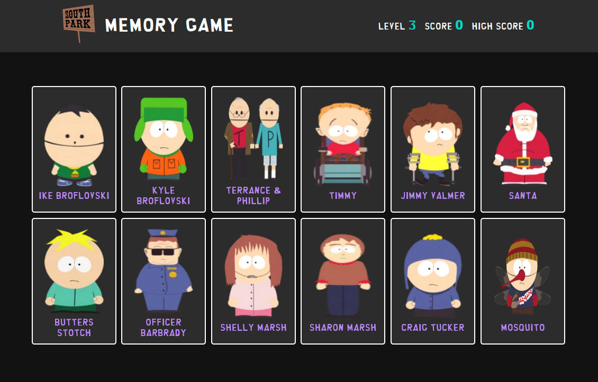

# Memory Game

A memory game based on the TV show Southpark. Built using React & Styled Components, bundled with Vite. 

[Demo here](https://southparkmemorygame.netlify.app/)



### Installing and running locally

```bash
git clone git@github.com:Casssb/memory-game.git
cd memory-game
npm install
npm run dev
```

## Tech Used
* React, Styled Components
* NPM & Vite for build
* react-parallax-tilt (for card hover effects)
* Sanitize CSS (for reset)
* SWC for compiling (supposedly it's 17 times faster than Babel)

## Features
* Asynchronous loading of image assets (with a loading message)
* Simple dark-mode styling
* Responsive on PC, Tablet & Mobile

## Thoughts
Had a ton of fun building this! The purpose was to get used to using the basic React hooks. I've mainly been working with class based react components for state & lifecycle management up until this point. Moving over to hooks was a total breeze! They seem to fit more clearly into the React teams vision of making it work in a composable way. I especially like how useEffect assumes the job of replacing pretty much all of the previous lifecycle methods.

I also found using CSS as JS fit really well with the style of programming React encourages (splitting everything into as many re-usable modules as possible). I can see how well this sort of structure would scale with a larger team of developers although I can't see why it's a better design pattern then just using post CSS modules? (I've spent many hours reading through discussions about this on Stack and it seems opinions are split).

## Possible Improvements
* The more I learn about Styled Components, the more I realise almost every element is transferable between modules. I'm sure there is more info I missed in the docs that could lead me to optimise.
* I was looking for a more optimal way to cache the images I use each time the game reloads them (once per level change and on first load). I looked into memoizing (memo) and even creating an API but ended up just going with Promise.all (making use of the JS Image object). I'm sure there was a more optimal way of doing this.
* I'm not totally happy with the way the 'loading...' message is displayed. Due to how small the image filesizes are (and how effective Vite is as a bundler) the message will mostly appear for just a fraction of a second between levels. I did consider forcing it to remain for a second or 2 (using setTimout). I'm not sure which is a better user experience; faster loading ? Or having the display sometimes appear as if it has a visual bug. I tested it using a a variety of different internet connection speeds (using the browser devtools) and decided to stick with keeping the message as is.
* As ever I'm not 100% happy with the styling (although I really like the Southpark font, cheers dafont.com!).

## Credits
* Southpark font from [Dafont.com](https://www.dafont.com/southpark.font)

